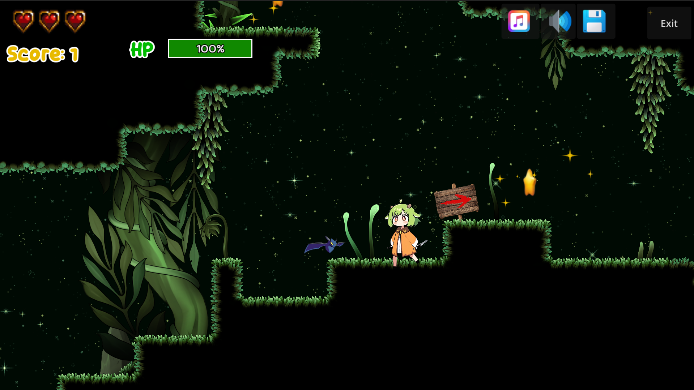
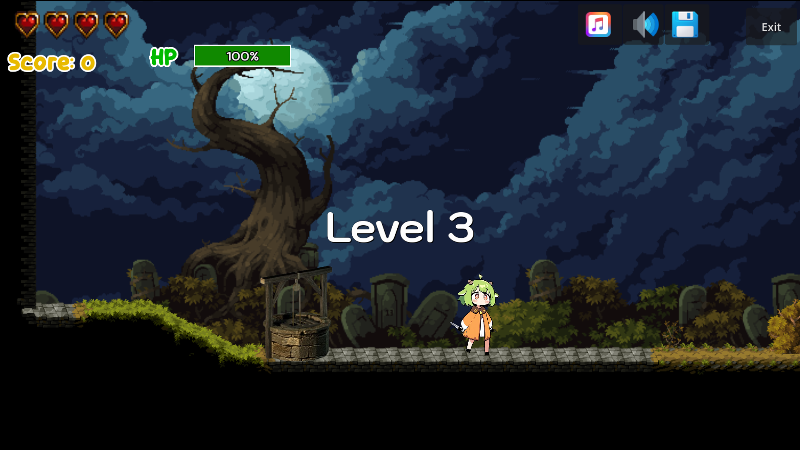

# 2D Platformer Game - Arriette Boss Battle

This project is a 2D Platformer game developed in Godot 4 as part of the **Computer Game Development** course at the **College of Computing, Khon Kaen University**.

---

## Student Information

* **Student ID:** [683380313-4]
* **Full Name:** [Saranyapong Kaewruan]

---

## Game Previews & Media

### Gameplay Screenshots

 

---

### Demo Links

* 🎥 **Gameplay Video (3:54):** [https://drive.google.com/file/d/1MN7A1bIMq9aTpE677pVtgD4uEzeajnzh/view?usp=sharing]
* 🎮 **Play Live Game (GitHub Pages):** [https://Saranyapong-K.github.io/Gamelab04/](https://Saranyapong-K.github.io/Gamelab04/)

---

## Features & Additions

* **Custom Boss Encounter (Arriette):** Features multi-stage melee attacks, jumping combos, ranged shooting mechanics, and dynamic player-tracking AI.
* **Dynamic Audio & UI Systems:** Context-aware boss health bar, area trigger music transitions, and death particle feedback.
* **Platformer Mechanics:** Responsive horizontal movement, jump/double-jump, and fireball shooting system.
* **Web & Mobile Support:** Touch controls and full HTML5 web build capability.

---

## Controls

| Input | Action |
|-------|--------|
| **A / Left Arrow** | Move left |
| **D / Right Arrow** | Move right |
| **Space / W** | Jump |
| **F** | Attack |

૮꒰ ˶• ༝ •˶꒱ა ♡
---

---

## Credits

* **Original Starter Kit:** [AdilDevStuff](https://github.com/AdilDevStuff/2D-Platformer-Starter-Kit)
* **Modified for Educational Use By:** College of Computing, Khon Kaen University