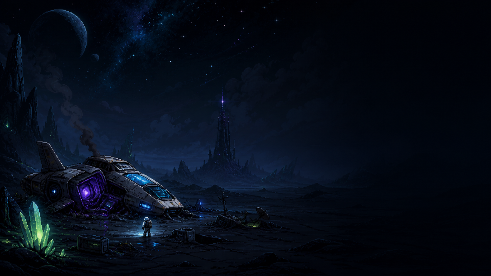

# OLETHROS // ZONE-67

โปรเจกต์เกม 2D แนว sci-fi survival/exploration พัฒนาด้วย Godot 4.7 ผู้เล่นต้องสำรวจดาว Zone-67 เก็บชิ้นส่วนยาน เอาตัวรอดจากสิ่งมีชีวิตต่างดาว และค้นหาต้นกำเนิดของสัญญาณลึกลับ

## เล่นบนเว็บ

[เปิดเกม OLETHROS // ZONE-67](https://siraanpimpa.github.io/project2d_2026/)



> หาก GitHub Pages ยังไม่เปิดใช้งาน ให้ตั้งค่า **Settings → Pages → Deploy from a branch → `main` / `docs`**

## การควบคุม

| ปุ่ม | การทำงาน |
|---|---|
| `WASD` / ปุ่มลูกศร | เคลื่อนที่ |
| `E` | โต้ตอบ |
| เมาส์ซ้ายค้าง | เล็งตามเคอร์เซอร์และยิง Pulse Rifle แบบ 360° |
| `Q` | ใช้ Med Kit 1 ชิ้น ฟื้น 25% ของ HP สูงสุด |
| `Enter` / คลิก | เลือกเมนูและอ่านข้อความต่อ |

บนมือถือใช้ D-pad ซ้ายเพื่อเคลื่อนที่, ลากวงเล็งขวาเพื่อเล็ง/ยิง, ปุ่ม `INTERACT` ที่ปรากฏตามบริบท และปุ่ม `MED KIT`

## วงจรเกม

สำรวจ Landing Zone, Crystal Field และ Abandoned Signal Base เพื่อเก็บ Scrap Metal, Energy Crystal และ Circuit Part จากนั้นกลับมาซ่อม Power, Navigation และ Engine ผ่าน mini-game ของแต่ละระบบ เมื่อซ่อมครบจะเริ่ม Final Defense; เอาตัวรอดจน Launch Preparation เสร็จแล้วกด `E` ที่ยานเพื่อจบภารกิจ

## แผนที่

- Landing Zone
- Crystal Field
- Abandoned Signal Base

ขอบเขตที่เดินผ่านได้และไม่ได้แก้ไขได้จาก `CollisionPolygon2D` ภายใต้ `ManualCollision` ในแต่ละฉากของโฟลเดอร์ `Scenes/Levels` โดยใช้เครื่องมือวาด Polygon ใน Godot Editor

## ระบบเกิดใหม่ของศัตรู

ศัตรูทั่วไปใน Crystal Field และ Abandoned Signal Base ใช้ spawn slots และเริ่มนับถอยหลัง 60 วินาทีเมื่อถูกกำจัด ระบบจะไม่สร้างเกินจำนวนสูงสุดของพื้นที่ และจะเลื่อนการเกิดหากผู้เล่นอยู่ใกล้หรือจุดเกิดอยู่ในกล้อง เมื่อออกแล้วกลับเข้าฉาก ศัตรูทั่วไปจะกลับมาพร้อม HP/AI เริ่มต้น แต่ไอเทมเนื้อเรื่อง ระบบยาน และความคืบหน้าถาวรยังคงเดิม

สำหรับฉาก Hive ใช้ `Scenes/Gameplay/hive_respawn_group.tscn` ซึ่งตั้งไว้ 30 วินาที สูงสุด 10 ตัว และรองรับ `alien_egg.tscn` ส่วนบอสหรือศัตรูเนื้อเรื่องต้องวางไว้นอก EnemyRespawnManager เพื่อไม่ให้เกิดใหม่จากระบบสำรวจ

## เปิดโปรเจกต์

1. เปิดโฟลเดอร์โปรเจกต์ด้วย Godot 4.7 หรือใหม่กว่า
2. กด `F5` เพื่อเริ่มเกมจากฉากหลัก

## อัปเดตเกมบนเว็บ

หลังแก้เกม ให้ Export preset **Web** ไปที่ `docs/index.html` แล้ว commit ไฟล์ที่เปลี่ยนใน `docs/` ขึ้น GitHub มิฉะนั้นหน้าเว็บจะยังเปิดเกมจาก Web export เวอร์ชันเดิม

ตัวอย่างคำสั่ง:

```powershell
Godot_v4.7-stable_win64.exe --headless --path . --export-release Web docs/index.html
```

## Credits

โปรเจกต์ตั้งต้นสำหรับรายวิชา Computer Game Development, College of Computing, Khon Kaen University และได้รับการพัฒนาต่อเป็น OLETHROS // ZONE-67
